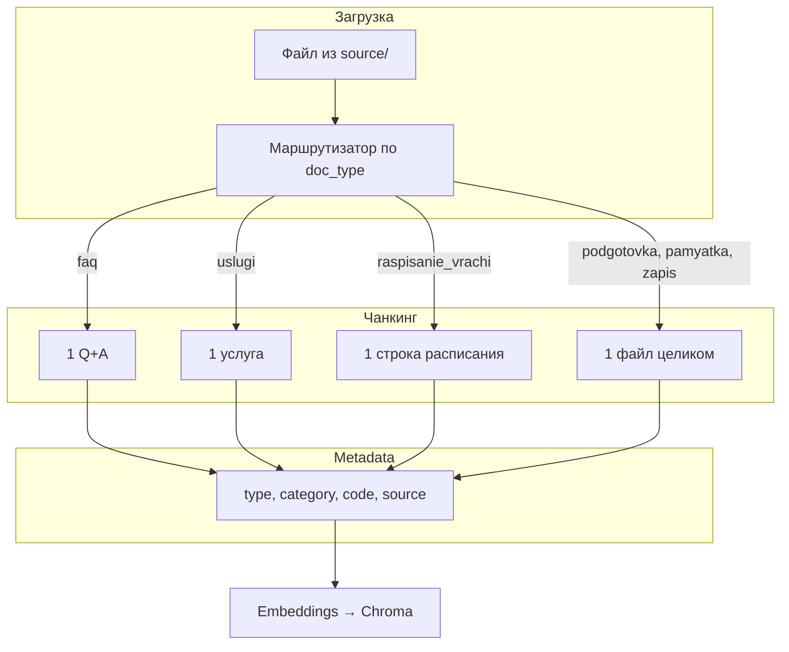

# Рекомендации по разбиению документов `/source` на чанки для векторизации

Проект: AI-ассистент клиники **INMYHEART** (RAG, Chroma, LangChain).

Документы в `source/` уже **логически разделены по типам** — для RAG это преимущество. Чанкинг не стоит строить одним универсальным `RecursiveCharacterTextSplitter` на всё; лучше использовать **стратегию по типу источника**.

---

## Общие принципы

| Принцип | Зачем |
|--------|--------|
| **Один смысловой ответ = один чанк** | Пациент спрашивает точечно («кортизол», «отмена записи») |
| **Не рвать пару вопрос–ответ** | Иначе retrieval найдёт вопрос без ответа |
| **Не склеивать несвязанные FAQ/услуги** | Снижает точность и смешивает контекст |
| **Метаданные важнее overlap** | `doc_type`, `category`, `service_code`, `source_file` дают больше пользы, чем overlap 200 символов |
| **Мелкие файлы (~0.5–2 KB текста)** | Часто **целиком = 1 чанк**; дробить имеет смысл только по смысловым блокам |

### Ориентиры по размеру

- **Атомарные типы** (FAQ, услуги, строки расписания): граница = логическая единица, **overlap = 0**.
- **Проза** (памятки, регламенты): **200–600 токенов** на чанк, overlap **0–80** (при необходимости).
- **Ожидаемый масштаб индекса** для текущего `source/`: ~40–50 чанков FAQ + ~127 услуг + ~20 подготовка + ~15 расписание/регламенты ≈ **200–220 осмысленных чанков** — подходящий объём для Chroma и MVP.

---

## 1. FAQ (`source/faq/`)

| Файл | Стратегия | Размер чанка |
|------|-----------|--------------|
| `FAQ_klinika.csv` | **1 строка = 1 чанк** | Вопрос + ответ + поля `категория`, `id` |
| `FAQ_zapis_rezhim.txt`, `FAQ_analizy_diagnostika.txt` | Парсер по блокам `В:` / `О:` → **1 пара = 1 чанк** | Не резать по длине символов |
| `FAQ_organizaciya_servis.md` | По заголовкам `###` → **1 вопрос = 1 чанк** | Заголовок категории (`##`) — в metadata, не обязательно в тело чанка |

### Шаблон чанка

```text
[metadata: type=faq, category=запись, source=FAQ_klinika.csv, id=3]
Вопрос: Как отменить запись без штрафа?
Ответ: Уведомите клинику не позднее чем за 3 часа...
```

### Дедупликация

Один и тот же вопрос может встречаться в CSV, TXT и MD. При индексации:

- выбрать **один канонический источник** (рекомендуется `FAQ_klinika.csv`), или
- дедуплицировать по нормализованному тексту вопроса перед записью в Chroma.

---

## 2. Подготовка к анализам (`source/podgotovka_analizov/`)

Файлы короткие (~15–25 строк текста, порядка 1–1.5 KB в `.txt`/`.md`). Тема уже атомарна (`podgotovka_krov_gormony`, `podgotovka_uzi_bryushnoy` и т.д.).

| Стратегия | Когда применять |
|-----------|-----------------|
| **1 файл = 1 чанк** (предпочтительно) | Текущий объём документов |
| **2 чанка** (редко) | Шапка (кабинет, срок, время) + блок правил — только если файлы существенно вырастут |

### Рекомендуемые metadata

- `doc_type` = `preparation`
- `test_slug` = `krov_gormony` (из имени файла)
- `related_service` = код из прайса, если есть связь (например `INM-1505`)

**Не смешивать** в одном чанке разные исследования (например «гормоны» и «ОАК») — для этого уже используются отдельные файлы.

---

## 3. Перечень услуг (`source/uslugi/`)

| Файл | Стратегия |
|------|-----------|
| `uslugi_laboratoriya.csv` | **1 строка = 1 чанк** |
| `uslugi_konsultacii.xlsx` | **1 строка = 1 чанк** |
| `uslugi_diagnostika_procedury.txt` | **1 строка таблицы = 1 чанк** |

### Шаблон чанка

```text
Услуга INM-1601: УЗИ органов брюшной полости. Цена: 3200 ₽.
Длительность: 25 мин. Подготовка: podgotovka_uzi_bryushnoy.
Описание: Печень, желчный, поджелудочная.
```

### Рекомендуемые metadata

- `service_code` (например `INM-1601`)
- `category`
- `price`
- `prep_doc` (ссылка на файл подготовки)

Запросы «сколько стоит ФГДС» и «как подготовиться к ФГДС» связывать через `prep_doc` → `podgotovka_fgds`, а не одним большим чанком-прайсом.

---

## 4. Расписание (`source/raspisanie/`)

| Файл | Стратегия |
|------|-----------|
| `raspisanie_rabota_kliniki.csv` | **1 чанк на весь файл** (мало строк) **или** **1 строка = 1 чанк** для запросов вида «режим в среду» |
| `raspisanie_vrachey.csv` | **1 строка = 1 чанк** — оптимально для «когда принимает кардиолог» |
| `raspisanie_laboratoriya_diagnostika.csv` | **1 строка = 1 чанк** |
| `raspisanie_prazdniki.txt` | **1 чанк** (файл маленький) |
| `raspisanie_google_sheets.md` | **Не индексировать в RAG для пациентов** или 1 чанк с `doc_type=admin` — инструкция для администратора, не справочник для ассистента |

### Пример чанка (врач)

```text
Кардиолог Петров В.И.: вторник и четверг 9:00–15:00, суббота 10:00–14:00.
```

Metadata: `doc_type=schedule`, `specialty=Кардиолог`, `doctor=Петров В.И.`

---

## 5. Памятки для пациентов (`source/pamyatki_pacientov/`)

Обычно 6–8 абзацев на тему → **1 документ = 1 чанк**.

Если памятка вырастет (условно **> 800 токенов**), резать по **нумерованным пунктам** или подзаголовкам, overlap **50–100**.

### Рекомендуемые metadata

- `doc_type` = `pamyatka`
- `topic` = `beremennost` (из имени файла, например `pamyatka_beremennost.pdf`)

---

## 6. Запись на приём (`source/zapis_priema/`)

Три разных документа по смыслу — логично **1 файл = 1 чанк** (сейчас ~150–250 токенов каждый).

| Файл | Содержание чанка |
|------|----------------|
| `zapis_sposoby_online.docx` | Способы записи (телефон, сайт, Telegram, корпоративная линия) |
| `zapis_otmena_ne_yavka.txt` | Отмена, перенос, неявка, опоздание, чекапы |
| `zapis_osobye_sluchai.md` | Дети, беременность, маломобильные, иностранные граждане |

**Не объединять** в один чанк «все правила записи» — типовые запросы пациентов различаются.

Metadata: `doc_type=zapis`, `topic=sposoby | otmena | osobye_sluchai`

---

## 7. Правила посещения (`source/poseshchenie_kliniki/`)

Аналогично записи — **1 файл = 1 чанк**:

| Файл | Содержание чанка |
|------|----------------|
| `poseshchenie_dokumenty_polisy.pdf` | Документы, ОМС, ДМС, дети, доверенности |
| `poseshchenie_poryadok_povedenie.docx` | Поведение, ОРВИ, телефоны, фото, курение |
| `poseshchenie_infrastruktura.txt` | Адрес, парковка, Wi‑Fi, кафетерий, доступная среда |

Metadata: `doc_type=poseshchenie`, `topic=dokumenty | povedenie | infrastruktura`

---

## Сводная таблица стратегий

| Тип | Гранулярность | Overlap | Splitter / метод |
|-----|---------------|---------|------------------|
| FAQ CSV | 1 вопрос + ответ | 0 | Свой парсер CSV |
| FAQ TXT | 1 пара `В:` / `О:` | 0 | Свой парсер |
| FAQ MD | 1 блок `###` | 0 | `MarkdownHeaderTextSplitter` или парсер заголовков |
| Подготовка к анализам | 1 файл | 0 | Без split или по `##` при росте объёма |
| Услуги CSV/XLSX/TXT | 1 услуга | 0 | По строкам |
| Расписание врачей / лаборатории | 1 строка CSV | 0 | CSV → строки |
| Расписание клиники / праздники | 1 файл | 0 | Целиком |
| Памятки | 1 файл | 0–50 | Целиком; при росте — по пунктам |
| Запись / посещение | 1 файл | 0 | Целиком |
| Google Sheets (admin) | не индексировать | — | — |

---

## Схема пайплайна индексации



---

## Чего избегать

1. **Единый `chunk_size=1000` на всё** — размывает FAQ и смешивает несвязанные ответы.
2. **Чанк из нескольких вопросов FAQ** — retrieval вернёт лишний контекст.
3. **Прайс на все услуги одним чанком** — плохо для запросов «цена ТТГ», «сколько стоит ФГДС».
4. **Индексация PDF/DOCX без очистки** — повтор «Клиника INMYHEART», адрес, контакты в каждом чанке; вынести повторяющуюся шапку в metadata один раз.
5. **Дубли FAQ** из CSV + TXT + MD без дедупликации — шум в выдаче и ложное повышение similarity.
6. **Индексация `raspisanie_google_sheets.md` как пациентский FAQ** — это операционная инструкция, не ответ пациенту.

---

## Практическая реализация (LangChain)

Идея: не один splitter, а **фабрика по `doc_type`** после классификации пути файла.

```python
# Псевдокод — маршрутизация чанкинга

def chunk_document(path: Path, text: str) -> list[Document]:
    parts = path.parts

    if "faq" in parts and path.suffix == ".csv":
        return chunk_faq_csv(path, text)

    if "faq" in parts and path.suffix == ".txt":
        return chunk_faq_vo_blocks(path, text)  # парсинг В:/О:

    if "faq" in parts and path.suffix == ".md":
        return chunk_faq_markdown_headers(path, text)  # по ###

    if path.suffix == ".csv" and "uslugi" in parts:
        return chunk_csv_rows(path, text, template=service_row_template)

    if path.name == "raspisanie_vrachey.csv":
        return chunk_csv_rows(path, text, template=doctor_schedule_template)

    if path.name == "raspisanie_laboratoriya_diagnostika.csv":
        return chunk_csv_rows(path, text, template=lab_schedule_template)

    if "podgotovka_" in path.name:
        return [Document(page_content=clean_text(text), metadata=prep_metadata(path))]

    if "pamyatki" in parts or "zapis_priema" in parts or "poseshchenie" in parts:
        if len(text) < 4000:  # эвристика: малый файл
            return [Document(page_content=clean_text(text), metadata=file_metadata(path))]

    if path.name == "raspisanie_google_sheets.md":
        return []  # не индексировать для пациентского ассистента

    # Fallback для крупных PDF/DOCX
    return RecursiveCharacterTextSplitter(
        chunk_size=500,
        chunk_overlap=80,
        separators=["\n\n", "\n", ". ", " "],
    ).split_documents([Document(page_content=text, metadata=file_metadata(path))])
```

### Рекомендуемый набор metadata (общий)

| Поле | Пример | Назначение |
|------|--------|------------|
| `source_file` | `faq/FAQ_klinika.csv` | Цитирование источника в ответе ассистента |
| `doc_type` | `faq`, `service`, `preparation`, `schedule`, `pamyatka`, `zapis`, `poseshchenie` | Фильтрация при retrieval |
| `category` | `запись`, `анализы` | Уточнение темы |
| `service_code` | `INM-1601` | Связь услуга ↔ подготовка |
| `test_slug` | `krov_gormony` | Подготовка к анализам |
| `language` | `ru` | Язык (для будущего multilang) |

---

## Связь типов документов при retrieval

Для составных вопросов полезно подтягивать **связанные** чанки (не обязательно в одном чанке):

| Запрос пациента | Первичный тип | Связанный тип |
|-----------------|---------------|---------------|
| «Сколько стоит УЗИ живота и как готовиться» | `service` (INM-1601) | `preparation` (podgotovka_uzi_bryushnoy) |
| «Когда кардиолог и как записаться» | `schedule` (строка врача) | `faq` (запись) |
| «Отменить приём» | `zapis` или `faq` | — |

Это можно реализовать через metadata-фильтры или второй проход retrieval по `prep_doc` / `service_code`.

---

## Итог

**Да, разные документы в `/source` нужно разбивать по-разному:**

- **Атомарные** (FAQ, услуги, строки расписания) — по **логической единице**, overlap 0.
- **Регламенты и памятки** — **файлом целиком** или по абзацам при росте объёма.
- **Таблицы** — **строкой**, с человекочитаемым текстом чанка (не сырой CSV без контекста).

Текущая структура `source/` уже близка к оптимальной для RAG; основная задача индексатора — **правильный парсер на тип файла** и **богатые metadata**, а не агрессивное дробление по символам.

После изменения правил чанкинга или документов выполните переиндексацию (`index_knowledge_base.py --reset` или через Docker — [`DOCKER.md`](DOCKER.md) §7).

---

*Документ подготовлен для проекта AI-ассистент INMYHEART. Актуально для структуры `source/` на момент генерации базы знаний.*
