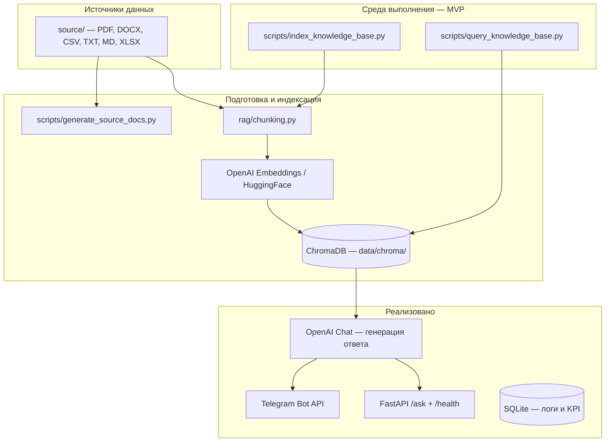

# Стек разработки проекта InMyHeart

**Проект:** AI-ассистент для медицинской клиники INMYHEART  
**Назначение:** ответы пациентам на организационные вопросы (запись, анализы, расписание, услуги) на основе базы знаний с подходом RAG  
**Репозиторий:** [github.com/DimonRonD/InMyHeart](https://github.com/DimonRonD/InMyHeart)

---

## 1. Обзор архитектуры



| Слой | Статус | Технологии |
|------|--------|------------|
| База знаний (документы) | Реализовано | `source/`, генерация скриптами |
| Чанкинг и метаданные | Реализовано | `rag/chunking.py`, `chunck_splitting.md` |
| Векторное хранилище | Реализовано | ChromaDB (локальный persist) |
| Эмбеддинги | Реализовано | OpenAI `text-embedding-3-small` (основной) |
| Семантический поиск | Реализовано | LangChain + Chroma |
| Генерация ответа (LLM) | Реализовано | OpenAI Chat API (`gpt-4o-mini`) |
| Интерфейс пользователя | Реализовано (MVP) | Telegram-бот, CLI, FastAPI |
| Backend API | Реализовано (MVP) | FastAPI `/health`, `/ask` |
| Логи и KPI | Реализовано | SQLite `data/inmyheart.db` |

---

## 2. Язык и среда выполнения

| Компонент | Выбор | Примечание |
|-----------|--------|------------|
| Язык | **Python 3.14** | Основной язык проекта |
| Виртуальное окружение | **venv** | `python -m venv venv` |
| Менеджер пакетов | **pip** | Зависимости в `requirements.txt` |
| ОС разработки | Windows 10/11 | Пути, кодировка UTF-8 в скриптах |
| Конфигурация | **python-dotenv** | Секреты в `.env` (не в git) |

---

## 3. Искусственный интеллект и RAG

### 3.1. Подход

**RAG (Retrieval-Augmented Generation)** — поиск релевантных фрагментов в базе знаний, затем формирование ответа LLM на основе найденного контекста (без «выдумывания» фактов вне базы).

### 3.2. Фреймворк оркестрации

| Технология | Версия (requirements) | Роль в проекте |
|------------|----------------------|----------------|
| **LangChain** | ≥ 0.3.0 | Абстракции Document, embeddings, vector store |
| **langchain-core** | ≥ 0.3.0 | Базовые типы и интерфейсы |
| **langchain-chroma** | ≥ 0.2.0 | Интеграция ChromaDB как VectorStore |
| **langchain-openai** | ≥ 0.2.0 | Эмбеддинги и (планируется) чат-модель OpenAI |
| **langchain-huggingface** | ≥ 0.1.0 | Локальные эмбеддинги (альтернатива без API) |
| **langchain-text-splitters** | ≥ 0.3.0 | Резерв для fallback-разбиения длинных текстов |

### 3.3. Модели эмбеддингов

| Провайдер | Модель | Когда используется |
|-----------|--------|-------------------|
| **OpenAI** (основной) | `text-embedding-3-small` | `EMBEDDING_PROVIDER=openai` в `.env` |
| **Hugging Face** (опционально) | `sentence-transformers/paraphrase-multilingual-MiniLM-L12-v2` | Локально, без API; `EMBEDDING_PROVIDER=huggingface` |

Переменные окружения: `OPENAI_API_KEY`, `OPENAI_EMBEDDING_MODEL`, `EMBEDDING_PROVIDER`.

### 3.4. Генеративная модель (по ТЗ, этап диалога)

| Параметр | Значение по ТЗ |
|----------|----------------|
| Провайдер | OpenAI (настраивается в `.env`) |
| Модели | `gpt-5.4-nano-2026-03-17` или `gpt-5.4-mini-2026-03-17` |
| Задача | Ответ на русском языке с опорой на retrieved chunks |
| Ограничения | Без диагнозов, без назначения лечения, эскалация к врачу/администратору |

На текущем этапе реализованы **индексация, RAG-диалог, CLI, FastAPI, Telegram-бот, SQLite-логи и pytest**.

### 3.5. Векторная база данных

| Технология | Версия | Роль |
|------------|--------|------|
| **ChromaDB** | ≥ 0.5.0 | Локальное хранение векторов и metadata |
| **langchain-chroma** | — | Обёртка `Chroma` как LangChain VectorStore |

| Параметр | Значение по умолчанию |
|----------|----------------------|
| Путь на диске | `data/chroma/` |
| Коллекция | `inmyheart_kb` |
| Манифест индекса | `data/chroma/index_manifest.json` |

**Metadata чанка** (для цитирования источника в ответе ассистента):

- `source_file`, `source_filename`, `source_folder`
- `doc_type` — `faq`, `service`, `preparation`, `schedule`, `pamyatka`, `zapis`, `poseshchenie`
- `chunk_id`, `chunk_index`
- Дополнительно: `category`, `service_code`, `test_slug`, `topic`, `price`, `prep_doc` и др.

Правила разбиения документов описаны в **`chunck_splitting.md`**.

---

## 4. Модули проекта (Python-пакет `rag/`)

| Модуль | Назначение |
|--------|------------|
| `rag/config.py` | Пути, имена коллекции, переменные из `.env` |
| `rag/models.py` | Dataclass `TextChunk` и сериализация metadata для Chroma |
| `rag/loaders.py` | Извлечение текста из PDF, DOCX, TXT, MD, CSV, XLSX |
| `rag/chunking.py` | Типизированный чанкинг по категориям файлов |
| `rag/embeddings.py` | Фабрика эмбеддингов OpenAI / HuggingFace, валидация API-ключа |
| `rag/store.py` | Создание коллекции Chroma, пакетная запись чанков |
| `rag/indexer.py` | `KnowledgeBaseIndexer` — полный цикл индексации `source/` |

---

## 5. Скрипты и CLI

| Скрипт | Назначение |
|--------|------------|
| `scripts/generate_source_docs.py` | Генерация демо-документов в `source/` |
| `scripts/source_content.py` | Уникальные тексты FAQ и каталог услуг |
| `scripts/index_knowledge_base.py` | Индексация в Chroma (`--reset`, `--dry-run`) |
| `scripts/query_knowledge_base.py` | Тестовый семантический поиск с выводом `source_file` |

---

## 6. База знаний (данные)

### 6.1. Форматы исходных документов

| Формат | Библиотека | Папки в `source/` |
|--------|------------|-------------------|
| PDF | **pypdf** | `podgotovka_analizov/`, `pamyatki_pacientov/`, `poseshchenie_kliniki/` |
| DOCX | **python-docx** | памятки, подготовка, запись, посещение |
| TXT, MD | встроенный I/O | FAQ, расписание, регламенты |
| CSV | **csv** (stdlib) | FAQ, услуги, расписание |
| XLSX | **openpyxl** | `uslugi/uslugi_konsultacii.xlsx` |

### 6.2. Категории контента

| Категория | Пример файлов | Чанков (ориентир) |
|-----------|---------------|-------------------|
| FAQ | `FAQ_klinika.csv` | 61 |
| Услуги | CSV, XLSX, TXT | 127 |
| Подготовка к анализам | 20 файлов, 4 формата | 20 |
| Расписание | CSV, TXT | 18 |
| Памятки | PDF, DOCX | 10 |
| Запись на приём | DOCX, TXT, MD | 3 |
| Посещение клиники | PDF, DOCX, TXT | 3 |

**Итого в индексе:** ~242 чанка (после дедупликации FAQ — только канонический CSV).

### 6.3. Генерация PDF/DOCX (вспомогательно)

| Библиотека | Назначение |
|------------|------------|
| **reportlab** | PDF с поддержкой кириллицы (Arial) |
| **python-docx** | DOCX-памятки и регламенты |

---

## 7. Интерфейсы и интеграции

### 7.1. Реализовано

- **CLI** — индексация и ассистент
- **FastAPI** — `scripts/run_api.py`, эндпоинты `/health`, `/ask`
- **Telegram-бот** — `scripts/telegram_bot.py`, Forum Topics, relay, SQLite

### 7.2. По техническому заданию (осталось)

| Интерфейс | Технология | Назначение |
|-----------|------------|------------|
| **Telegram-бот** | Telegram Bot API | Основной канал для пациентов ✅ |
| **REST API** | **FastAPI** | `/health`, `/ask` ✅ |
| **Веб-чат** | HTML/JS + `/ask` | Альтернативный канал (план) |
| **CRM / МИС** | Could have | Не входит в MVP |

Рекомендуемые Python-библиотеки для следующего этапа (добавить в `requirements.txt` при реализации):

- `python-telegram-bot` или `aiogram` — Telegram
- `fastapi`, `uvicorn` — HTTP API
- `langchain-openai` — `ChatOpenAI` для RAG-цепочки

---

## 8. Конфигурация и секреты

Файл **`.env`** (локально, в `.gitignore`):

| Переменная | Описание |
|------------|----------|
| `OPENAI_API_KEY` | Ключ OpenAI |
| `EMBEDDING_PROVIDER` | `openai` или `huggingface` |
| `OPENAI_EMBEDDING_MODEL` | `text-embedding-3-small` |
| `TELEGRAM_BOT_TOKEN` | Токен бота от @BotFather |
| `SOURCE_DIR` | Путь к `source/` |
| `CHROMA_PERSIST_DIR` | Путь к `data/chroma/` |
| `CHROMA_COLLECTION` | Имя коллекции Chroma |

Шаблон без секретов: **`.env.example`**.

---

## 9. Инструменты разработки и DevOps

| Инструмент | Назначение |
|------------|------------|
| **Git** | Контроль версий |
| **GitHub** | Удалённый репозиторий [DimonRonD/InMyHeart](https://github.com/DimonRonD/InMyHeart) |
| **Cursor IDE** | Разработка с AI-ассистентом |
| **Yandex.Disk** | Синхронизация рабочей копии проекта |

### Исключения из git (`.gitignore`)

- `.env` — ключи API
- `data/chroma/` — векторный индекс (пересобирается)
- `venv/`, `__pycache__/`
- `source.zip` — архив-дубликат

---

## 10. Нефункциональные требования (из ТЗ)

| Требование | Целевое значение | Как обеспечивается стеком |
|------------|------------------|---------------------------|
| Язык ответов | Русский | Промпт + русскоязычная база; multilingual embeddings при HF |
| Время ответа | ≤ 5 с (типовой вопрос) | Локальный Chroma, компактный индекс (~242 чанка) |
| Точность | 85–90% на тестовом наборе | RAG + типизированный чанкинг + metadata |
| Безопасность | Не хранить ПДн в базе знаний | Синтетические документы без ФИО пациентов |
| Объяснимость | Ссылка на источник | `source_file` в metadata каждого чанка |
| Актуализация базы | По мере изменений регламентов | Переиндексация: `index_knowledge_base.py --reset` |

---

## 11. Зависимости (`requirements.txt`)

```
chromadb>=0.5.0
langchain>=0.3.0
langchain-chroma>=0.2.0
langchain-core>=0.3.0
langchain-huggingface>=0.1.0
langchain-openai>=0.2.0
langchain-text-splitters>=0.3.0
python-dotenv>=1.0.0
sentence-transformers>=3.0.0
openpyxl>=3.1.0
python-docx>=1.1.0
pypdf>=5.0.0
```

Дополнительно при генерации документов (не обязательны для RAG-runtime): `reportlab`, `fpdf2`.

---

## 12. Дорожная карта расширения стека

| Этап | Компонент | Технология |
|------|-----------|------------|
| ✅ 1 | Документы и чанкинг | `source/`, `rag/chunking.py` |
| ✅ 2 | Векторный индекс | ChromaDB + OpenAI Embeddings |
| ✅ 3 | Тест retrieval | `query_knowledge_base.py` |
| ✅ 4 | RAG-цепочка с LLM | LangChain + OpenAI Chat |
| ✅ 5 | Telegram-бот | python-telegram-bot, Forum Topics, relay |
| ✅ 6 | FastAPI + healthcheck | uvicorn, `/health`, `/ask` |
| ✅ 7 | Логирование диалогов | SQLite + PII redact |
| ✅ 8 | Фильтр MED/PII + pytest | классификатор + `tests/` |
| 🔲 9 | Веб-чат | HTML → FastAPI |
| 🔲 10 | Боевые документы клиники | замена `source/` |

---

## 13. Связанные документы проекта

| Файл | Содержание |
|------|------------|
| `README.md` | Быстрый старт |
| `chunck_splitting.md` | Стратегии разбиения на чанки |
| `Техническое задание.docx` | Требования, KPI, сценарии |
| `TZ_STATUS.md` | Статус реализации vs ТЗ (пояснительная записка) |
| `source/README.md` | Структура базы знаний |
| `.env.example` | Шаблон конфигурации |

---

*Документ актуален для MVP: RAG, CLI, FastAPI, Telegram-бот, SQLite-логи, pytest. База `source/` — синтетическая (см. `source/DATA_NOTICE.md`).*
